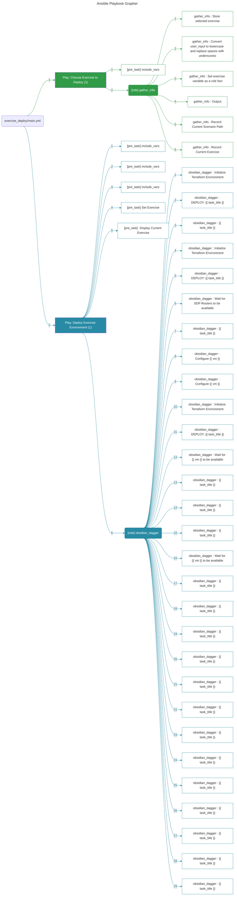

# Cyber Defense eXercise (CDX) Exercise Deployer - OBSIDIAN DAGGER
## main.yml Playbook

```mermaid
---
title: Ansible Playbook Grapher
---
%%{ init: { "flowchart": { "curve": "bumpX" } } }%%
flowchart LR
	%% Start of the playbook 'exercise_deploy/main.yml'
	playbook_f33451dd("exercise_deploy/main.yml")
		%% Start of the play 'Play: Choose Exercise to Deploy (1)'
		play_183b634d["Play: Choose Exercise to Deploy (1)"]
		style play_183b634d fill:#319b48,color:#ffffff
		playbook_f33451dd --> |"1"| play_183b634d
		linkStyle 0 stroke:#319b48,color:#319b48
			pre_task_044716a8["[pre_task]  include_vars"]
			style pre_task_044716a8 stroke:#319b48,fill:#ffffff
			play_183b634d --> |"1"| pre_task_044716a8
			linkStyle 1 stroke:#319b48,color:#319b48
			%% Start of the role 'gather_info'
			play_183b634d --> |"2"| role_d6611c42
			linkStyle 2 stroke:#319b48,color:#319b48
			role_d6611c42("[role] gather_info")
			style role_d6611c42 fill:#319b48,color:#ffffff,stroke:#319b48
				task_d00a9728[" gather_info : Store selected exercise"]
				style task_d00a9728 stroke:#319b48,fill:#ffffff
				role_d6611c42 --> |"1"| task_d00a9728
				linkStyle 3 stroke:#319b48,color:#319b48
				task_92c3b21a[" gather_info : Convert user_input to lowercase and replace spaces with underscores"]
				style task_92c3b21a stroke:#319b48,fill:#ffffff
				role_d6611c42 --> |"2"| task_92c3b21a
				linkStyle 4 stroke:#319b48,color:#319b48
				task_8a83b687[" gather_info : Set exercise variable as a role fact"]
				style task_8a83b687 stroke:#319b48,fill:#ffffff
				role_d6611c42 --> |"3"| task_8a83b687
				linkStyle 5 stroke:#319b48,color:#319b48
				task_7178ac55[" gather_info : Output"]
				style task_7178ac55 stroke:#319b48,fill:#ffffff
				role_d6611c42 --> |"4"| task_7178ac55
				linkStyle 6 stroke:#319b48,color:#319b48
				task_d5c6df6c[" gather_info : Record Current Scenario Path"]
				style task_d5c6df6c stroke:#319b48,fill:#ffffff
				role_d6611c42 --> |"5"| task_d5c6df6c
				linkStyle 7 stroke:#319b48,color:#319b48
				task_559605bf[" gather_info : Record Current Exercise"]
				style task_559605bf stroke:#319b48,fill:#ffffff
				role_d6611c42 --> |"6"| task_559605bf
				linkStyle 8 stroke:#319b48,color:#319b48
			%% End of the role 'gather_info'
		%% End of the play 'Play: Choose Exercise to Deploy (1)'
		%% Start of the play 'Play: Deploy Exercise Environment (1)'
		play_9215770f["Play: Deploy Exercise Environment (1)"]
		style play_9215770f fill:#288aa4,color:#ffffff
		playbook_f33451dd --> |"2"| play_9215770f
		linkStyle 9 stroke:#288aa4,color:#288aa4
			pre_task_173a256e["[pre_task]  include_vars"]
			style pre_task_173a256e stroke:#288aa4,fill:#ffffff
			play_9215770f --> |"1"| pre_task_173a256e
			linkStyle 10 stroke:#288aa4,color:#288aa4
			pre_task_4f2fedcf["[pre_task]  include_vars"]
			style pre_task_4f2fedcf stroke:#288aa4,fill:#ffffff
			play_9215770f --> |"2"| pre_task_4f2fedcf
			linkStyle 11 stroke:#288aa4,color:#288aa4
			pre_task_14084aef["[pre_task]  include_vars"]
			style pre_task_14084aef stroke:#288aa4,fill:#ffffff
			play_9215770f --> |"3"| pre_task_14084aef
			linkStyle 12 stroke:#288aa4,color:#288aa4
			pre_task_95230e97["[pre_task]  Set Exercise"]
			style pre_task_95230e97 stroke:#288aa4,fill:#ffffff
			play_9215770f --> |"4"| pre_task_95230e97
			linkStyle 13 stroke:#288aa4,color:#288aa4
			pre_task_0d8fe6a1["[pre_task]  Display Current Exercise"]
			style pre_task_0d8fe6a1 stroke:#288aa4,fill:#ffffff
			play_9215770f --> |"5"| pre_task_0d8fe6a1
			linkStyle 14 stroke:#288aa4,color:#288aa4
			%% Start of the role 'obsidian_dagger'
			play_9215770f --> |"6"| role_df6d4105
			linkStyle 15 stroke:#288aa4,color:#288aa4
			role_df6d4105("[role] obsidian_dagger")
			style role_df6d4105 fill:#288aa4,color:#ffffff,stroke:#288aa4
				task_85264f4e[" obsidian_dagger : Initialize Terraform Environment"]
				style task_85264f4e stroke:#288aa4,fill:#ffffff
				role_df6d4105 --> |"1"| task_85264f4e
				linkStyle 16 stroke:#288aa4,color:#288aa4
				task_dd680f4e[" obsidian_dagger : DEPLOY: {{ task_title }}"]
				style task_dd680f4e stroke:#288aa4,fill:#ffffff
				role_df6d4105 --> |"2"| task_dd680f4e
				linkStyle 17 stroke:#288aa4,color:#288aa4
				task_7e5e30c7[" obsidian_dagger : {{ task_title }}"]
				style task_7e5e30c7 stroke:#288aa4,fill:#ffffff
				role_df6d4105 --> |"3"| task_7e5e30c7
				linkStyle 18 stroke:#288aa4,color:#288aa4
				task_542753b7[" obsidian_dagger : Initialize Terraform Environment"]
				style task_542753b7 stroke:#288aa4,fill:#ffffff
				role_df6d4105 --> |"4"| task_542753b7
				linkStyle 19 stroke:#288aa4,color:#288aa4
				task_cd11dc7a[" obsidian_dagger : DEPLOY: {{ task_title }}"]
				style task_cd11dc7a stroke:#288aa4,fill:#ffffff
				role_df6d4105 --> |"5"| task_cd11dc7a
				linkStyle 20 stroke:#288aa4,color:#288aa4
				task_c8067e27[" obsidian_dagger : Wait for SDP Routers to be available"]
				style task_c8067e27 stroke:#288aa4,fill:#ffffff
				role_df6d4105 --> |"6"| task_c8067e27
				linkStyle 21 stroke:#288aa4,color:#288aa4
				task_ec166142[" obsidian_dagger : {{ task_title }}"]
				style task_ec166142 stroke:#288aa4,fill:#ffffff
				role_df6d4105 --> |"7"| task_ec166142
				linkStyle 22 stroke:#288aa4,color:#288aa4
				task_df1ea25e[" obsidian_dagger : Configure {{ vm }}"]
				style task_df1ea25e stroke:#288aa4,fill:#ffffff
				role_df6d4105 --> |"8"| task_df1ea25e
				linkStyle 23 stroke:#288aa4,color:#288aa4
				task_bc4d2760[" obsidian_dagger : Configure {{ vm }}"]
				style task_bc4d2760 stroke:#288aa4,fill:#ffffff
				role_df6d4105 --> |"9"| task_bc4d2760
				linkStyle 24 stroke:#288aa4,color:#288aa4
				task_b46acf1b[" obsidian_dagger : Initialize Terraform Environment"]
				style task_b46acf1b stroke:#288aa4,fill:#ffffff
				role_df6d4105 --> |"10"| task_b46acf1b
				linkStyle 25 stroke:#288aa4,color:#288aa4
				task_b6aa85fa[" obsidian_dagger : DEPLOY: {{ task_title }}"]
				style task_b6aa85fa stroke:#288aa4,fill:#ffffff
				role_df6d4105 --> |"11"| task_b6aa85fa
				linkStyle 26 stroke:#288aa4,color:#288aa4
				task_74ec3a35[" obsidian_dagger : Wait for {{ vm }} to be available"]
				style task_74ec3a35 stroke:#288aa4,fill:#ffffff
				role_df6d4105 --> |"12"| task_74ec3a35
				linkStyle 27 stroke:#288aa4,color:#288aa4
				task_2926c48e[" obsidian_dagger : {{ task_title }}"]
				style task_2926c48e stroke:#288aa4,fill:#ffffff
				role_df6d4105 --> |"13"| task_2926c48e
				linkStyle 28 stroke:#288aa4,color:#288aa4
				task_04e4f753[" obsidian_dagger : {{ task_title }}"]
				style task_04e4f753 stroke:#288aa4,fill:#ffffff
				role_df6d4105 --> |"14"| task_04e4f753
				linkStyle 29 stroke:#288aa4,color:#288aa4
				task_8a0dfad5[" obsidian_dagger : {{ task_title }}"]
				style task_8a0dfad5 stroke:#288aa4,fill:#ffffff
				role_df6d4105 --> |"15"| task_8a0dfad5
				linkStyle 30 stroke:#288aa4,color:#288aa4
				task_e50c9fb9[" obsidian_dagger : Wait for {{ vm }} to be available"]
				style task_e50c9fb9 stroke:#288aa4,fill:#ffffff
				role_df6d4105 --> |"16"| task_e50c9fb9
				linkStyle 31 stroke:#288aa4,color:#288aa4
				task_517adf8b[" obsidian_dagger : {{ task_title }}"]
				style task_517adf8b stroke:#288aa4,fill:#ffffff
				role_df6d4105 --> |"17"| task_517adf8b
				linkStyle 32 stroke:#288aa4,color:#288aa4
				task_5e154c1b[" obsidian_dagger : {{ task_title }}"]
				style task_5e154c1b stroke:#288aa4,fill:#ffffff
				role_df6d4105 --> |"18"| task_5e154c1b
				linkStyle 33 stroke:#288aa4,color:#288aa4
				task_2968657b[" obsidian_dagger : {{ task_title }}"]
				style task_2968657b stroke:#288aa4,fill:#ffffff
				role_df6d4105 --> |"19"| task_2968657b
				linkStyle 34 stroke:#288aa4,color:#288aa4
				task_336091bd[" obsidian_dagger : {{ task_title }}"]
				style task_336091bd stroke:#288aa4,fill:#ffffff
				role_df6d4105 --> |"20"| task_336091bd
				linkStyle 35 stroke:#288aa4,color:#288aa4
				task_1b95dbd8[" obsidian_dagger : {{ task_title }}"]
				style task_1b95dbd8 stroke:#288aa4,fill:#ffffff
				role_df6d4105 --> |"21"| task_1b95dbd8
				linkStyle 36 stroke:#288aa4,color:#288aa4
				task_7a971101[" obsidian_dagger : {{ task_title }}"]
				style task_7a971101 stroke:#288aa4,fill:#ffffff
				role_df6d4105 --> |"22"| task_7a971101
				linkStyle 37 stroke:#288aa4,color:#288aa4
				task_ba367492[" obsidian_dagger : {{ task_title }}"]
				style task_ba367492 stroke:#288aa4,fill:#ffffff
				role_df6d4105 --> |"23"| task_ba367492
				linkStyle 38 stroke:#288aa4,color:#288aa4
				task_727b98df[" obsidian_dagger : {{ task_title }}"]
				style task_727b98df stroke:#288aa4,fill:#ffffff
				role_df6d4105 --> |"24"| task_727b98df
				linkStyle 39 stroke:#288aa4,color:#288aa4
				task_064aa7c5[" obsidian_dagger : {{ task_title }}"]
				style task_064aa7c5 stroke:#288aa4,fill:#ffffff
				role_df6d4105 --> |"25"| task_064aa7c5
				linkStyle 40 stroke:#288aa4,color:#288aa4
				task_f131f1a4[" obsidian_dagger : {{ task_title }}"]
				style task_f131f1a4 stroke:#288aa4,fill:#ffffff
				role_df6d4105 --> |"26"| task_f131f1a4
				linkStyle 41 stroke:#288aa4,color:#288aa4
				task_beb2e68e[" obsidian_dagger : {{ task_title }}"]
				style task_beb2e68e stroke:#288aa4,fill:#ffffff
				role_df6d4105 --> |"27"| task_beb2e68e
				linkStyle 42 stroke:#288aa4,color:#288aa4
				task_e6126b7c[" obsidian_dagger : {{ task_title }}"]
				style task_e6126b7c stroke:#288aa4,fill:#ffffff
				role_df6d4105 --> |"28"| task_e6126b7c
				linkStyle 43 stroke:#288aa4,color:#288aa4
				task_f8da61ef[" obsidian_dagger : {{ task_title }}"]
				style task_f8da61ef stroke:#288aa4,fill:#ffffff
				role_df6d4105 --> |"29"| task_f8da61ef
				linkStyle 44 stroke:#288aa4,color:#288aa4
			%% End of the role 'obsidian_dagger'
		%% End of the play 'Play: Deploy Exercise Environment (1)'
	%% End of the playbook 'exercise_deploy/main.yml'


```