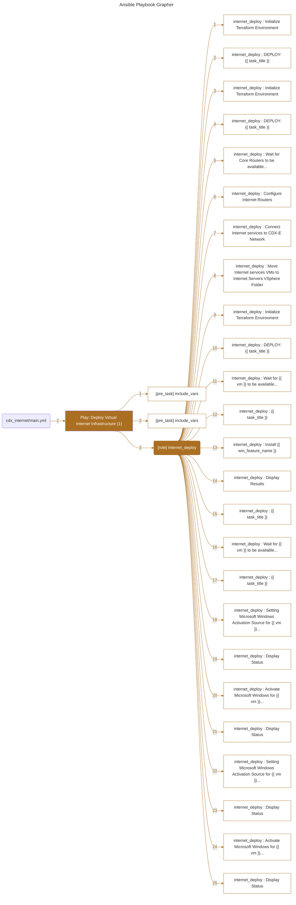

# Cyber Defense eXercise (CDX) Internet Environment Deployer
## main.yml Playbook

```mermaid
---
title: Ansible Playbook Grapher
---
%%{ init: { "flowchart": { "curve": "bumpX" } } }%%
flowchart LR
	%% Start of the playbook 'cdx_internet/main.yml'
	playbook_c3ded21a("cdx_internet/main.yml")
		%% Start of the play 'Play: Deploy Virtual Internet Infrastructure (1)'
		play_f429dd27["Play: Deploy Virtual Internet Infrastructure (1)"]
		style play_f429dd27 fill:#aa6f22,color:#ffffff
		playbook_c3ded21a --> |"1"| play_f429dd27
		linkStyle 0 stroke:#aa6f22,color:#aa6f22
			pre_task_460b9fe8["[pre_task]  include_vars"]
			style pre_task_460b9fe8 stroke:#aa6f22,fill:#ffffff
			play_f429dd27 --> |"1"| pre_task_460b9fe8
			linkStyle 1 stroke:#aa6f22,color:#aa6f22
			pre_task_45e7397a["[pre_task]  include_vars"]
			style pre_task_45e7397a stroke:#aa6f22,fill:#ffffff
			play_f429dd27 --> |"2"| pre_task_45e7397a
			linkStyle 2 stroke:#aa6f22,color:#aa6f22
			%% Start of the role 'internet_deploy'
			play_f429dd27 --> |"3"| role_c7b5990a
			linkStyle 3 stroke:#aa6f22,color:#aa6f22
			role_c7b5990a("[role] internet_deploy")
			style role_c7b5990a fill:#aa6f22,color:#ffffff,stroke:#aa6f22
				task_acd20906[" internet_deploy : Initialize Terraform Environment"]
				style task_acd20906 stroke:#aa6f22,fill:#ffffff
				role_c7b5990a --> |"1"| task_acd20906
				linkStyle 4 stroke:#aa6f22,color:#aa6f22
				task_ec3f5144[" internet_deploy : DEPLOY: {{ task_title }}"]
				style task_ec3f5144 stroke:#aa6f22,fill:#ffffff
				role_c7b5990a --> |"2"| task_ec3f5144
				linkStyle 5 stroke:#aa6f22,color:#aa6f22
				task_95dca8b2[" internet_deploy : Initialize Terraform Environment"]
				style task_95dca8b2 stroke:#aa6f22,fill:#ffffff
				role_c7b5990a --> |"3"| task_95dca8b2
				linkStyle 6 stroke:#aa6f22,color:#aa6f22
				task_49afaa3a[" internet_deploy : DEPLOY: {{ task_title }}"]
				style task_49afaa3a stroke:#aa6f22,fill:#ffffff
				role_c7b5990a --> |"4"| task_49afaa3a
				linkStyle 7 stroke:#aa6f22,color:#aa6f22
				task_f262c8d8[" internet_deploy : Wait for Core Routers to be available..."]
				style task_f262c8d8 stroke:#aa6f22,fill:#ffffff
				role_c7b5990a --> |"5"| task_f262c8d8
				linkStyle 8 stroke:#aa6f22,color:#aa6f22
				task_d5e53f16[" internet_deploy : Configure Internet Routers"]
				style task_d5e53f16 stroke:#aa6f22,fill:#ffffff
				role_c7b5990a --> |"6"| task_d5e53f16
				linkStyle 9 stroke:#aa6f22,color:#aa6f22
				task_b00a27e1[" internet_deploy : Connect Internet services to CDX-E Network"]
				style task_b00a27e1 stroke:#aa6f22,fill:#ffffff
				role_c7b5990a --> |"7"| task_b00a27e1
				linkStyle 10 stroke:#aa6f22,color:#aa6f22
				task_948b809e[" internet_deploy : Move Internet services VMs to Internet Servers VSphere Folder"]
				style task_948b809e stroke:#aa6f22,fill:#ffffff
				role_c7b5990a --> |"8"| task_948b809e
				linkStyle 11 stroke:#aa6f22,color:#aa6f22
				task_f12d6f47[" internet_deploy : Initialize Terraform Environment"]
				style task_f12d6f47 stroke:#aa6f22,fill:#ffffff
				role_c7b5990a --> |"9"| task_f12d6f47
				linkStyle 12 stroke:#aa6f22,color:#aa6f22
				task_47414f75[" internet_deploy : DEPLOY: {{ task_title }}"]
				style task_47414f75 stroke:#aa6f22,fill:#ffffff
				role_c7b5990a --> |"10"| task_47414f75
				linkStyle 13 stroke:#aa6f22,color:#aa6f22
				task_44a4f9f5[" internet_deploy : Wait for {{ vm }} to be available..."]
				style task_44a4f9f5 stroke:#aa6f22,fill:#ffffff
				role_c7b5990a --> |"11"| task_44a4f9f5
				linkStyle 14 stroke:#aa6f22,color:#aa6f22
				task_72ca76e8[" internet_deploy : {{ task_title }}"]
				style task_72ca76e8 stroke:#aa6f22,fill:#ffffff
				role_c7b5990a --> |"12"| task_72ca76e8
				linkStyle 15 stroke:#aa6f22,color:#aa6f22
				task_3517f137[" internet_deploy : Install {{ win_feature_name }}"]
				style task_3517f137 stroke:#aa6f22,fill:#ffffff
				role_c7b5990a --> |"13"| task_3517f137
				linkStyle 16 stroke:#aa6f22,color:#aa6f22
				task_0cd2fd93[" internet_deploy : Display Results"]
				style task_0cd2fd93 stroke:#aa6f22,fill:#ffffff
				role_c7b5990a --> |"14"| task_0cd2fd93
				linkStyle 17 stroke:#aa6f22,color:#aa6f22
				task_babbd3d3[" internet_deploy : {{ task_title }}"]
				style task_babbd3d3 stroke:#aa6f22,fill:#ffffff
				role_c7b5990a --> |"15"| task_babbd3d3
				linkStyle 18 stroke:#aa6f22,color:#aa6f22
				task_4617d030[" internet_deploy : Wait for {{ vm }} to be available..."]
				style task_4617d030 stroke:#aa6f22,fill:#ffffff
				role_c7b5990a --> |"16"| task_4617d030
				linkStyle 19 stroke:#aa6f22,color:#aa6f22
				task_176e2ab4[" internet_deploy : {{ task_title }}"]
				style task_176e2ab4 stroke:#aa6f22,fill:#ffffff
				role_c7b5990a --> |"17"| task_176e2ab4
				linkStyle 20 stroke:#aa6f22,color:#aa6f22
				task_006efb01[" internet_deploy : Setting Microsoft Windows Activation Source for {{ vm }}..."]
				style task_006efb01 stroke:#aa6f22,fill:#ffffff
				role_c7b5990a --> |"18"| task_006efb01
				linkStyle 21 stroke:#aa6f22,color:#aa6f22
				task_fbe8d195[" internet_deploy : Display Status"]
				style task_fbe8d195 stroke:#aa6f22,fill:#ffffff
				role_c7b5990a --> |"19"| task_fbe8d195
				linkStyle 22 stroke:#aa6f22,color:#aa6f22
				task_bf7c6836[" internet_deploy : Activate Microsoft Windows for {{ vm }}..."]
				style task_bf7c6836 stroke:#aa6f22,fill:#ffffff
				role_c7b5990a --> |"20"| task_bf7c6836
				linkStyle 23 stroke:#aa6f22,color:#aa6f22
				task_7bdeb4d3[" internet_deploy : Display Status"]
				style task_7bdeb4d3 stroke:#aa6f22,fill:#ffffff
				role_c7b5990a --> |"21"| task_7bdeb4d3
				linkStyle 24 stroke:#aa6f22,color:#aa6f22
				task_f179ab6e[" internet_deploy : Setting Microsoft Windows Activation Source for {{ vm }}..."]
				style task_f179ab6e stroke:#aa6f22,fill:#ffffff
				role_c7b5990a --> |"22"| task_f179ab6e
				linkStyle 25 stroke:#aa6f22,color:#aa6f22
				task_f4e906c9[" internet_deploy : Display Status"]
				style task_f4e906c9 stroke:#aa6f22,fill:#ffffff
				role_c7b5990a --> |"23"| task_f4e906c9
				linkStyle 26 stroke:#aa6f22,color:#aa6f22
				task_d7f2f280[" internet_deploy : Activate Microsoft Windows for {{ vm }}..."]
				style task_d7f2f280 stroke:#aa6f22,fill:#ffffff
				role_c7b5990a --> |"24"| task_d7f2f280
				linkStyle 27 stroke:#aa6f22,color:#aa6f22
				task_92877dba[" internet_deploy : Display Status"]
				style task_92877dba stroke:#aa6f22,fill:#ffffff
				role_c7b5990a --> |"25"| task_92877dba
				linkStyle 28 stroke:#aa6f22,color:#aa6f22
			%% End of the role 'internet_deploy'
		%% End of the play 'Play: Deploy Virtual Internet Infrastructure (1)'
	%% End of the playbook 'cdx_internet/main.yml'


```